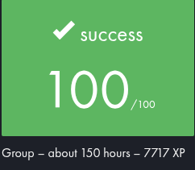
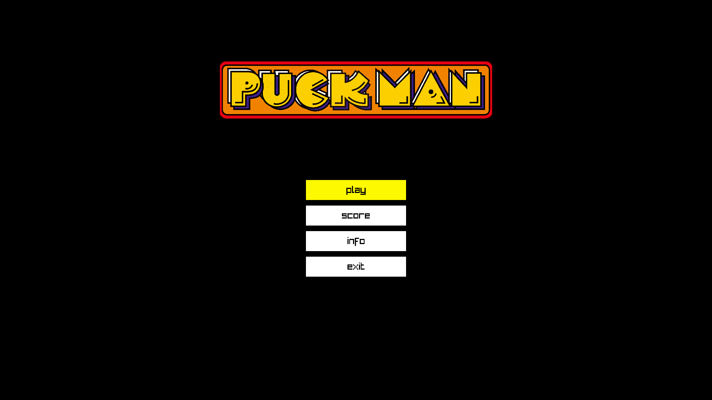
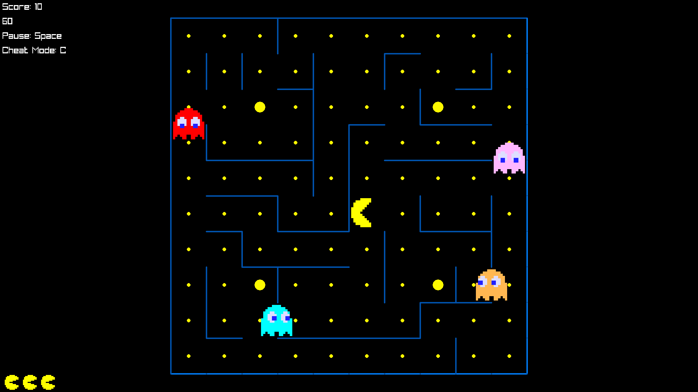
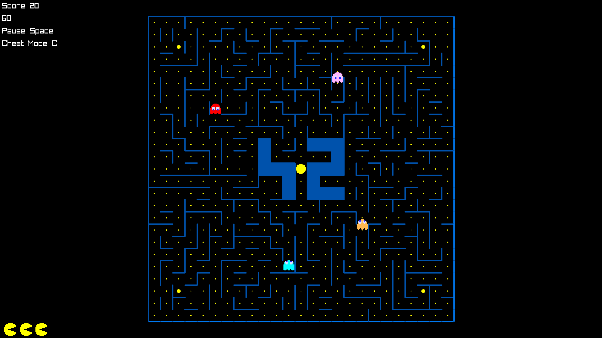
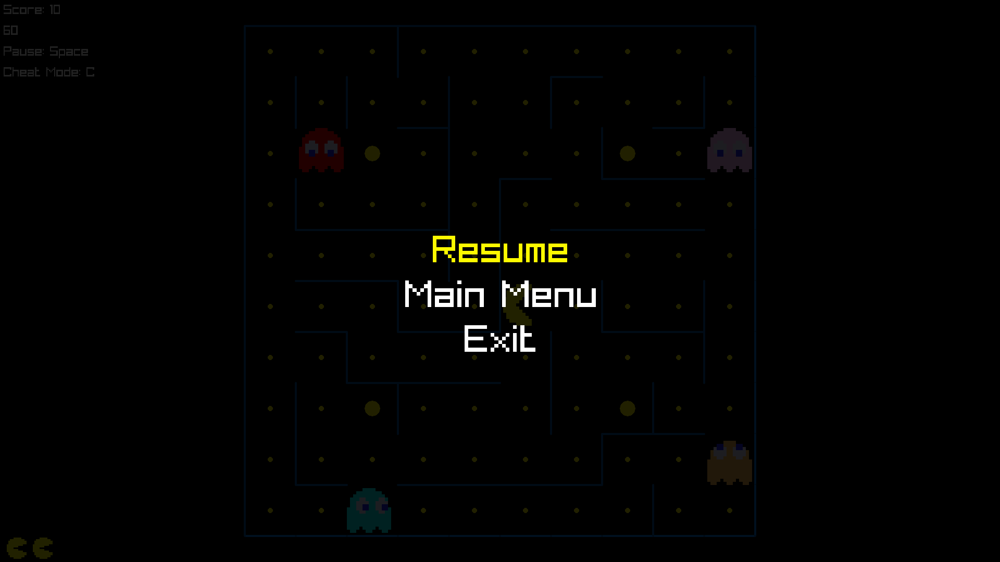
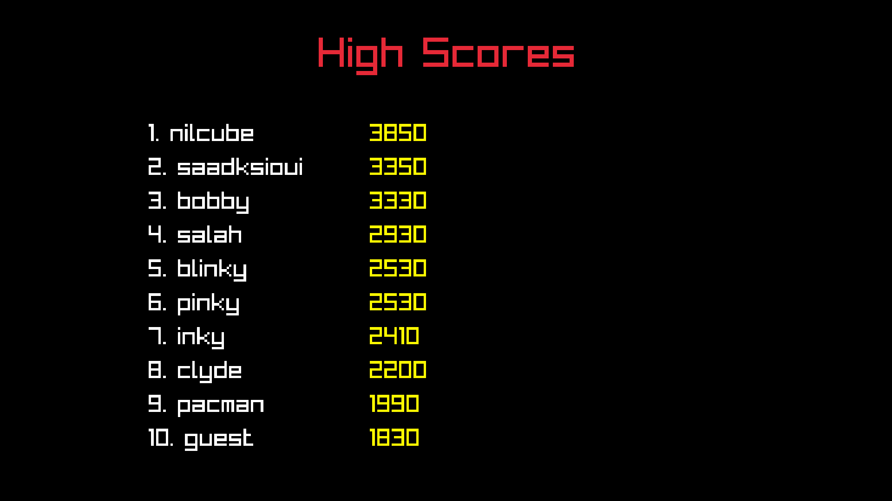

*This project has been created as part of the 42 curriculum by sksioui, smahraz*

# Pacman


<p align="center">
  
</p>


## Interfaces







## Description

A from-scratch recreation of the classic 1980 arcade game Pac-Man, built in Python with an object-oriented, modular architecture. The game features JSON-based configuration, procedurally generated mazes (via an externally assigned `mazegenerator` package), autonomous ghost AI with arcade-authentic personalities, a persistent highscore system, and a hardware-accelerated UI using **Pyray (Raylib)**.

The goal of this project is to reproduce the core Pac-Man gameplay loop — collect pacgums, avoid or hunt ghosts using power pellets, progress through a sequence of increasingly randomized levels — while following clean software engineering practices: strict static typing (`mypy`), Pydantic data validation, robust physics math, and a clear separation of concerns between our UI and the physics engine.

## Instructions

```bash
make install     # install dependencies
make run         # launch the game with config.json
make debug       # launch under pdb
make lint        # flake8 + mypy
make clean       # remove caches

```

Manual launch:

```bash
python3 pacman.py config.json

```

The program takes exactly one argument: a path to a JSON configuration file.

## Configuration

The config file is validated natively using `Pydantic`. It supports standard JSON with internal parsing to strip out `#`, `//`, and `/* ... */` comments prior to validation.

| Key | Type | Default | Description |
| --- | --- | --- | --- |
| `highscore_path` | string | `"highscores.json"` | Path to the persistent highscore file |
| `levels` | list of `{width, height}` | 10 entries | Maze dimensions per level |
| `lives` | int | `3` | Starting player lives |
| `points_per_pacgum` | int | `10` | Score awarded per pacgum eaten |
| `points_per_super_pacgum` | int | `50` | Score awarded per super-pacgum eaten |
| `points_per_ghost` | int | `200` | Score awarded per edible ghost eaten |
| `seed` | int | Random Int | Fixed seed for level 1's maze |
| `level_max_time` | int | `90` | Seconds allowed per level |

**Faulty config handling:** The game features robust fallback handling. If a key is missing, possesses the wrong type, or violates size constraints (enforced via Pydantic `Field(ge=..., gt=...)`), the engine catches the `ValidationError` and safely falls back to default values. The game will never crash due to a bad configuration file.

## Highscore

Highscores are stored as a flat JSON array of `{"name": ..., "score": ...}` objects, sorted descending by score, capped at the top 10 entries.

**Validation rules enforced:**

* `name`: string, exactly 10 characters (padded), alphanumeric and spaces only. Input is natively constrained via a custom Pyray keyboard listener in `menus.py`.
* `score`: non-negative integer.
* Strict type-casting guarantees sortability (`key=lambda item: int(item['score'])`).
* File creation is handled dynamically; a missing file safely initializes a new leaderboard.

## Maze Generation

We utilize the assigned `mazegenerator` package, invoked via our `GamePage` orchestrator before passing the matrix to the engine.

**Interface used:**

```python
MazeGenerator(size=(lvl.height, lvl.width), seed=CONFIG.seed, perfect=False)

```

* `perfect` is explicitly set to `False` to ensure the maze generates circular loops and alternate routes, preventing Pac-Man from being unavoidably trapped in dead ends.
* The returned bitmask grid (where `1`=North, `2`=East, `4`=South, `8`=West) is dynamically mapped to our custom `_Direction(IntEnum)` class for bitwise collision checking.

## Implementation & Physics

The game is fully playable and uses a custom **continuous delta-time physics engine**. Unlike grid-snapping engines, entities move fluidly by fractions of a pixel.

* **Anti-Tunneling Math:** We implemented a two-sided modulo threshold (`dx < 0.15 or dx > 0.85`) to ensure entities correctly identify intersections regardless of their travel direction, preventing wall-clipping.
* **Arcade AI:** The 4 ghosts feature mathematically distinct personalities powered by a custom Breadth-First Search (`_run_bfs`) algorithm:
* *Blinky (Red):* Aggressive direct pursuit.
* *Pinky (Pink):* Targets 4 tiles ahead of Pac-Man to cut him off.
* *Inky (Cyan):* Uses a dynamic pivot vector between Blinky and Pac-Man.
* *Clyde (Orange):* Pursues until within 8 tiles, then retreats to his corner.


* **Frightened State:** Bypasses BFS to use an arcade-authentic "Panic" intersection algorithm that prevents U-turns.
* **Developer Toolkit:** An evaluator cheat menu can be toggled by pressing `C`, granting access to Invincibility (F1), Level Skipping (F2), AI Freezing (F3), Extra Lives (F4), and Speed Boosts (F5).

## General Software Architecture

```
pacman.py              entry point: parses argv, loads config, launches HomePage
paclib/
├── config.py           Pydantic schemas, default values, and JSON sanitizer
├── engine.py           Core physics, BFS pathfinding, collision, and rendering logic
├── menus.py            UI state machine: Home, Leaderboard, Score Input, & Campaign Orchestrator
├── score.py            Pydantic validation schema for highscore entries
├── errors.py           Custom exceptions module
└── _gui_init.py        Pyray window initialization and monitor scaling constants
assets/
├── logo.png            Main menu branding
└── everything.png      Master sprite sheet (maze textures, pacman, ghosts)

```

## Project Management

Managed via a GitHub Projects board (Todo / In Progress / Done) with issues tied to three milestones — `M1: Foundations`, `M2: Full loop`, `M3: Polish` — and tracked with a Gantt-style timeline view.

**Team Allocation:**

* **smahraz**: Config validation (Pydantic), UI implementation (menus.py), Pyray integration, entity continuous physics, maze rendering logic.
* **sksioui**: Ghost targeting algorithms (BFS), game loop orchestration, collision math, highscore file I/O, project management.

## Resources

* [Pac-Man (Wikipedia)](https://en.wikipedia.org/wiki/Pac-Man?utm_source=gemini) — original game history and ghost AI behavior reference.
* [Raylib Python CFFI Docs](https://electronstudio.github.io/raylib-python-cffi/?utm_source=gemini) — rendering and keyboard input API.
* Python official docs: `json`, `pathlib`, `collections.deque`.

## Uploaded Version

The uploaded itch.io release provides a natively compiled standalone executable generated via Nuitka. This version bundles the C-engine bindings and does not require Python, Pyray, or the mazegenerator package to be installed on your system.

1. Go to https://s4l1x.itch.io/pacman-1337
2. Download and extract the `.zip` archive.
3. Open a terminal and navigate inside the extracted folder.
4. Grant execution permissions to the binary if necessary:
```bash
chmod +x pacman.bin

```


4. Launch the game by passing the bundled configuration file as an argument:
```bash
./pacman.bin config.json

```


**AI usage:**
AI was used strictly as a technical mentor, architecture consultant, and code reviewer. It was not used as an automated code generator. AI helped explain delta-time physics trade-offs, diagnosed floating-point logic bugs (such as wall-tunneling and BFS infinite loops), and assisted in scaffolding this documentation. No production logic in this repository was written blindly by AI without manual engineering, testing, and integration.


